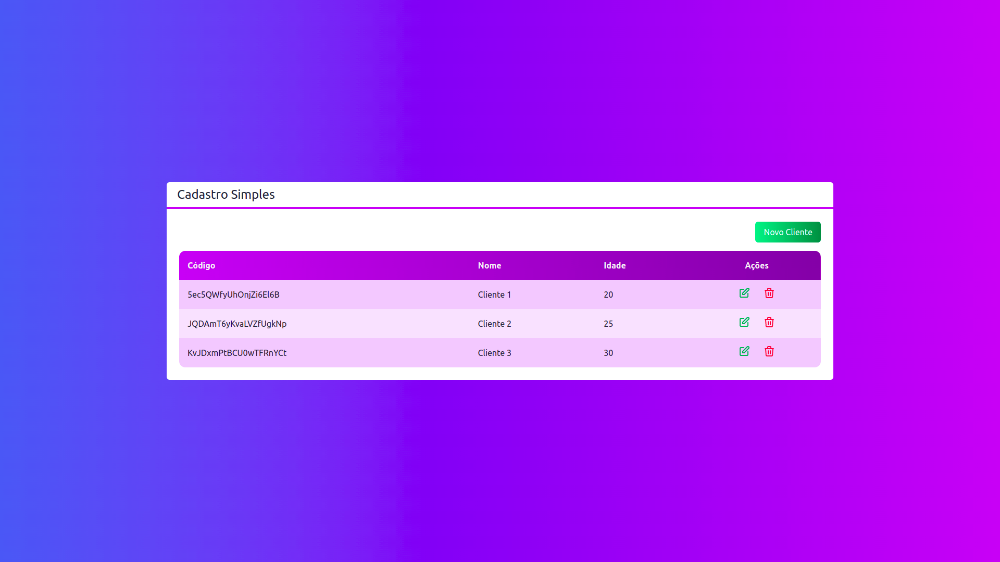

## Sistema de Cadastro (CRUD)

## Sobre

  

O Sistema de Cadastro consiste em uma aplicação web  que permite o cadastro de usuários, e também alteração e e exluisão dos cadastros.

Acesse o projeto: https://

## 🚀 Tecnologias utilizadas

Esse projeto foi desenvolvido com as seguintes tecnologias:

## :memo: Licença

Esse projeto está sob a licença ... . Veja o arquivo [LICENSE](LICENSE) para mais detalhes.

## Autor

Hudson Santos

https://www.linkedin.com/in/hudsonsamuelsantos/
