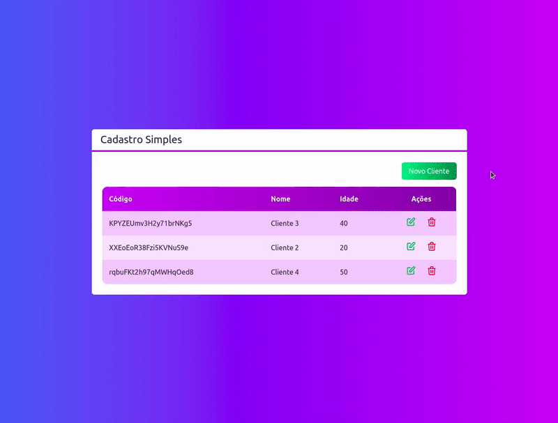

# Sistema de Cadastro (CRUD)

## Sobre

  

O Sistema de Cadastro (CRUD) é uma aplicação web que permite o cadastro de clientes.

Acesse o projeto: https://crud-cadastro-next-typescript-tailwind.vercel.app/

## Funcionalidades

:heavy_check_mark:  Cadastrar clientes

:heavy_check_mark:  Alterar as dados do cadastro

:heavy_check_mark:  Excluir um cadastro

## Tecnologias utilizadas

- React
- Next
- TypeScript
- Tailwind

## Desenvolvedor :octocat:

**Linkedin:** [Hudson Santos](https://www.linkedin.com/in/hudsonsamuelsantos/)
